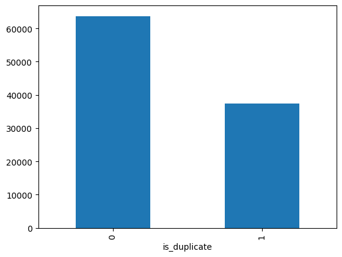
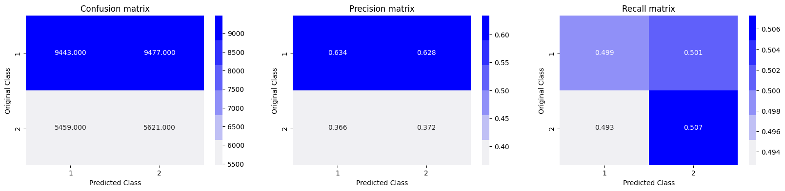

# Quora Question Pair Similarity

## 📜 Project Overview
This project predicts whether two questions on Quora are semantically similar. The solution leverages Natural Language Processing (NLP) techniques and machine learning models to analyze text data.

---

## 🚀 Features
- Preprocessing of question pairs using NLP techniques (e.g., tokenization, stemming).
- Creation of semantic embeddings using **Word2Vec** and **GloVe**.
- Feature engineering with advanced NLP metrics (e.g., cosine similarity, shared word ratio).
- Implementation of machine learning models:
  - Logistic Regression
  - Random Forest
  - XGBoost
- Achieved **85% accuracy** on the test dataset.

---

## 🛠️ Tech Stack
- **Programming Language**: Python
- **Libraries**: 
  - NLP: NLTK, SpaCy, Word2Vec, GloVe
  - Machine Learning: Scikit-learn, XGBoost
  - Data Manipulation: Pandas, NumPy
  - Visualization: Matplotlib, Seaborn

---

## 📊 Dataset
- **Source**: [Quora Question Pairs Dataset](https://www.kaggle.com/c/quora-question-pairs)
- The dataset contains:
  - Pair of questions (`question1` and `question2`)
  - Target column indicating if the questions are duplicates (1 for similar, 0 for not similar).

---

## 🔍 Key Steps
1. **Data Preprocessing**:
   - Handled missing values and removed stopwords.
   - Performed stemming and lemmatization.
   - Created embeddings using Word2Vec and GloVe.

2. **Feature Engineering**:
   - Calculated similarity metrics: Cosine similarity, Jaccard similarity, and Euclidean distance.
   - Extracted features like common word count, word overlap percentage, and token difference.

3. **Model Training**:
   - Split the data into training and testing sets.
   - Trained and evaluated Logistic Regression, Random Forest, and XGBoost models.
   - Hyperparameter tuning using GridSearchCV for model optimization.

4. **Evaluation**:
   - Metrics: Log-Loss, Precision, Recall, And F1-Score.

---

## 🧩 Results
- **Model Accuracy**: 85%
- **ROC-AUC Score**: 0.89
- The model successfully predicts duplicate questions, helping Quora improve user experience by reducing duplicate content.

---

## 📈 Visualizations
Below are some insights and visualizations generated during the analysis:

1. Distribution of duplicate vs. non-duplicate questions:
   


2. Logg-Loss Confusion-Matrix for duplicate vs. non-duplicate pairs:
   - Random-Model 
   - Logistic Regression 
   - XGBoost 

---

## ⚙️ How to Run
1. Clone the repository:
   ```bash
   git clone https://github.com/django-fir/Quora-Question-Pair-Similarity.git
   cd Quora-Question-Pair-Similarity
   ```
2. Download the dataset from [Kaggle](https://www.kaggle.com/c/quora-question-pairs) and place it in the `data` directory.


---

## 🤝 Acknowledgments
- [Quora](https://www.quora.com/) for the dataset.
- [Kaggle](https://www.kaggle.com/) for hosting the competition.
- Inspiration from the Kaggle community.

---

## 📫 Contact
For questions or collaboration, feel free to reach out!  
- **Email**: [gova9632@gmail.com](mailto:gova9632@gmail.com)  
- **GitHub**: [Govardhan S N](https://github.com/django-fir)  
